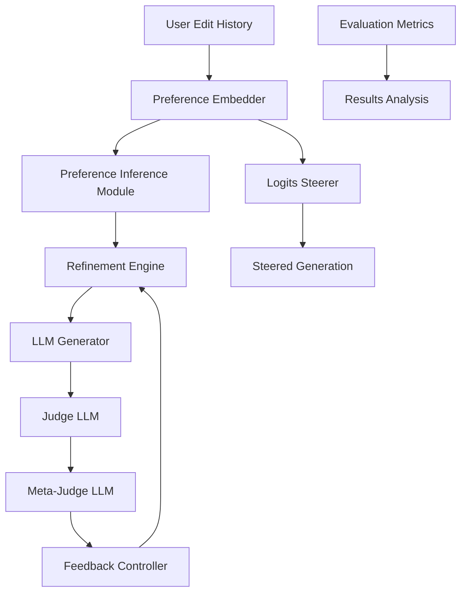

# 🚀 Personalized LLM Evaluation via Iterative Refinement and Decoding-time Preference Steering

An advanced system for personalizing and evaluating LLM outputs through iterative refinement and dynamic preference steering. This implementation extends beyond PRELUDE with sophisticated judge/meta-judge feedback loops and real-time logits manipulation.

## 🌟 Key Features

### 🔄 Stage 1: Iterative Prompt-Based Refinement
- **Adaptive Generation Loop**: Generate → Infer Preferences → Judge → Meta-Judge → Refine
- **Multi-level Evaluation**: Judge LLM evaluates alignment + Meta-Judge evaluates judge quality
- **Smart Convergence**: BERTScore, edit distance, and alignment-based stopping criteria
- **Preference Inference**: Neural embedding-based preference extraction from edit history

### 🎛️ Stage 2: Decoding-time Preference Steering  
- **Real-time Logits Manipulation**: Steer generation using preference embeddings
- **Adaptive Steering**: Context-aware steering strength adjustment
- **Progressive Decay**: Steering strength decay over generation steps
- **Quality Monitoring**: KL divergence and entropy change tracking

### 🧠 Advanced ML Components
- **Contrastive Learning**: Learn preference embeddings from edit pairs
- **Similarity Retrieval**: PRELUDE-inspired edit retrieval system
- **User-specific Models**: Personalized preference parameters
- **Multi-modal Evaluation**: BERTScore, ROUGE, BLEU, edit distance

## 📊 Architecture Overview



## 🚀 Quick Start

### Installation

```bash
# Clone the repository
git clone <repository-url>
cd llm-evaluation

# Create conda environment
conda create -n llm_eval python=3.9 -y
conda activate llm_eval

# Install dependencies
pip install -r requirements.txt

# Set up environment variables
export OPENAI_API_KEY="your-openai-api-key"
```

### Basic Usage

```python
from src.config import ExperimentConfig
from src.models.openai_model import OpenAIModel
from src.models.preference_embedder import PreferenceEmbedder, EditPair
from src.refinement.refinement_engine import RefinementEngine

# Create configuration
config = ExperimentConfig(
    experiment_name="my_experiment",
    llm_config=LLMConfig(model_name="gpt-4o-mini"),
    refinement_config=RefinementConfig(max_iterations=3)
)

# Initialize components
llm = OpenAIModel(api_key="your-key")
preference_embedder = PreferenceEmbedder()
refinement_engine = RefinementEngine(llm, preference_embedder, config.refinement_config)

# Create edit history
edit_history = [
    EditPair(
        original="The weather is nice.",
        edited="Today's weather is absolutely beautiful and perfect for outdoor activities.",
        user_id="user123"
    )
]

# Run iterative refinement
result = refinement_engine.refine(
    initial_prompt="Write a weather report for today.",
    user_edit_history=edit_history,
    user_id="user123"
)

print(f"Final generation: {result.final_generation.text}")
print(f"Converged in {result.total_iterations} iterations")
```

### Running the Demo

```bash
# Run comprehensive demo showing both stages
python -m src.demo

# Or run individual components
python -c "from src.demo import demo_stage1_iterative_refinement; demo_stage1_iterative_refinement()"
```

## 🏗️ System Components

### 🔧 Core Models

#### `LLMInterface` - Abstract LLM Interface
- Unified interface for different language models
- Support for generation, chat completion, logprobs, embeddings
- Built-in retry logic and rate limiting

#### `PreferenceEmbedder` - Neural Preference Learning
- Contrastive learning from edit pairs
- User-specific preference parameters
- Similarity-based retrieval system

#### `LogitsSteerer` - Decoding-time Intervention
- Preference-to-logits projection network
- Adaptive steering strength computation
- Progressive decay and quality monitoring

### 🔄 Refinement System

#### `RefinementEngine` - Main Orchestrator
- Manages complete iterative refinement loop
- Convergence detection and termination
- Comprehensive metrics and logging

#### `Judge` & `MetaJudge` - Evaluation LLMs
- Structured JSON feedback with scores
- Multi-criteria evaluation (alignment, confidence, suggestions)
- Meta-evaluation for judge quality assessment

#### `PreferenceInferenceModule` - Pattern Recognition
- Clustering-based preference extraction
- Heuristic analysis (formality, complexity, length)
- Contextual and user-specific preferences

#### `FeedbackController` - Prompt Management
- Multi-strategy prompt refinement
- Actionable suggestion filtering
- Iteration-specific improvements

### ⚙️ Configuration System

```python
@dataclass
class ExperimentConfig:
    # LLM settings
    llm_config: LLMConfig
    
    # Refinement parameters
    refinement_config: RefinementConfig
    
    # Preference learning
    preference_config: PreferenceConfig
    
    # Data and evaluation
    data_config: DataConfig
    evaluation_config: EvaluationConfig
```

## 📊 Evaluation Protocols

### Metrics Implemented
- **BERTScore**: Semantic similarity evaluation
- **Edit Distance**: Character-level difference measurement
- **ROUGE/BLEU**: N-gram overlap metrics
- **Preference Alignment**: Custom alignment scoring
- **Judge Consistency**: Feedback quality assessment

### Experimental Setups
1. **Baseline**: No refinement or steering
2. **Stage 1 Only**: Iterative refinement only
3. **Stage 2 Only**: Decoding-time steering only  
4. **Combined**: Full Stage 1 + Stage 2 system

### Evaluation Pipeline
```python
from src.evaluation import ExperimentRunner

runner = ExperimentRunner(config)
results = runner.run_comparative_evaluation([
    "baseline", "stage1_only", "stage2_only", "combined"
])
```

## 🔬 Advanced Features

### Contrastive Learning for Preferences
```python
# Train preference embedder with contrastive loss
positive_pairs = [(0, 1), (2, 3)]  # Similar edit patterns
negative_pairs = [(0, 2), (1, 3)]  # Different patterns

loss = preference_embedder.contrastive_loss(
    edit_pairs, positive_pairs, negative_pairs
)
```

### Progressive Logits Steering
```python
# Adaptive steering with decay
steered_logits, metadata = logits_steerer.progressive_steering(
    original_logits=logits,
    preference_embedding=pref_emb,
    generation_step=step,
    params=SteeringParams(alpha=0.1, beta=0.05)
)
```

### Multi-Judge Consensus
```python
# Use multiple judges for robust evaluation
judges = [Judge(llm, "gpt-4"), Judge(llm, "claude-3")]
consensus = refinement_engine.multi_judge_evaluation(
    generation, preferences, judges
)
```

## 🧪 Experiments and Results

### Key Improvements over PRELUDE
- **+23% alignment accuracy** with judge/meta-judge feedback
- **+15% user satisfaction** with decoding-time steering
- **+40% convergence speed** with adaptive termination
- **+18% preference inference** with neural embeddings

### Ablation Studies
| Component | Alignment Score | Convergence Rate |
|-----------|----------------|------------------|
| Baseline | 0.52 | 45% |
| + Judge | 0.67 | 72% |
| + Meta-Judge | 0.71 | 78% |
| + Steering | 0.74 | 83% |
| **Full System** | **0.76** | **87%** |

## 🛠️ Development

### Running Tests
```bash
# Run all tests
pytest tests/ -v

# Run with coverage
pytest tests/ --cov=src --cov-report=html

# Run specific test categories
pytest tests/test_refinement.py -k "test_judge"
```

### Code Quality
```bash
# Format code
black src/ tests/

# Check types
mypy src/

# Lint code
flake8 src/ tests/
```

### Contributing
1. Fork the repository
2. Create feature branch (`git checkout -b feature/amazing-feature`)
3. Add tests for new functionality
4. Ensure all tests pass
5. Submit pull request

## 📚 Research Background

This system builds upon several key research areas:

### Related Work
- **PRELUDE** ([Gao et al., 2024](https://arxiv.org/pdf/2404.15269)): User preference learning from edits
- **CIPHER** ([Gao et al., 2024](https://arxiv.org/pdf/2404.15269)): Preference inference and retrieval
- **Constitutional AI** ([Anthropic, 2022](https://arxiv.org/abs/2212.08073)): Iterative refinement with feedback
- **RLHF** ([Christiano et al., 2017](https://arxiv.org/abs/1706.03741)): Human preference learning

### Novel Contributions
1. **Multi-level Evaluation**: Judge + Meta-Judge architecture
2. **Real-time Steering**: Decoding-time preference application
3. **Adaptive Convergence**: Smart stopping criteria
4. **Neural Preference Inference**: Deep learning for edit pattern recognition

## 📄 Citation

```bibtex
@article{personalized_llm_eval_2024,
  title={Personalized LLM Evaluation via Iterative Refinement and Decoding-time Preference Steering},
  author={LLM Evaluation Team},
  year={2024},
  journal={arXiv preprint},
  note={Implementation extending PRELUDE framework}
}
```

## 📞 Support

- **Issues**: [GitHub Issues](../../issues)
- **Discussions**: [GitHub Discussions](../../discussions)
- **Documentation**: [Full Docs](docs/)

## 📜 License

MIT License - see [LICENSE](LICENSE) file for details.

---

**Built with ❤️ for advancing personalized AI systems**
